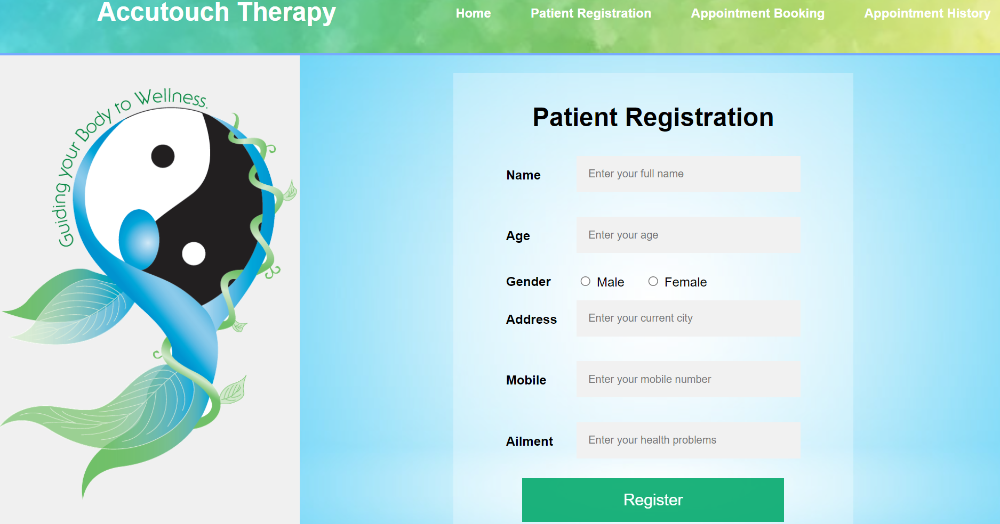

# CIP_Project
## Flask web application for Code in place final project

## Features
List of features included in the project
    -Patient registration
    -Appointment Booking
    -View Appointment History

## Screenshots
Screenshots for the web application are listed below

Example:




## Installation
Step-by-step instructions on how to set up the project locally.

1. Clone the repository
    ```sh
    git clone https://github.com/JasvanthiA/CIP_Project.git
    cd CIP_Project
    ```
2. Create and activate a virtual environment
    ```sh
    python -m venv venv
    source venv/bin/activate  # On Windows use `venv\Scripts\activate`
    ```
3. Install the dependencies
    ```sh
    pip install -r requirements.txt
    ```
4. Set up the database
    ```sh
    flask db init
    flask db migrate -m "Initial migration."
    flask db upgrade
    ```

## Usage
How to run the application.

1. Run the Flask development server
    ```sh
    flask run
    ```
2. Open your web browser and go to `http://127.0.0.1:5000/`


## Contact
-Jasvanthi
    -www.linkedin.com/in/jasvanthi
    -jasvanthi94@gmail.com


